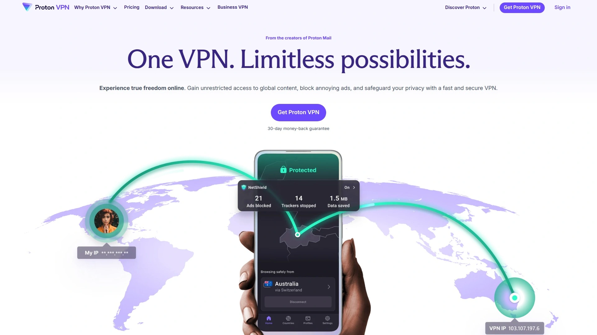

# No More Privacy Worries! Recommend 9 Secure VPN Game-Changers

Browsing the internet without VPN protection feels like shouting your personal information through a megaphone in a crowded room—your ISP tracks every site you visit, advertisers build detailed profiles of your behavior, government agencies monitor your connections, and hackers intercept unencrypted data on public WiFi networks. Secure VPN services solve this by encrypting all internet traffic through military-grade protocols, masking your real IP address, and routing connections through remote servers making online activity completely anonymous. Modern VPN providers combine zero-logs policies verified by independent audits, blazing-fast WireGuard protocol speeds losing under 10% bandwidth, and global server networks spanning 100+ countries enabling geo-restriction bypass for streaming content.

Whether you prioritize absolute privacy for sensitive communications, affordable protection for entire household devices, or specialized features like double VPN and obfuscated servers for restrictive networks, these platforms provide infrastructure separating casual internet users from privacy-conscious professionals. The best VPN services deliver 99.9% uptime guarantees, support for unlimited simultaneous connections across all devices, and transparent no-logs policies backed by third-party audits confirming zero user data retention. Users report reclaiming online privacy immediately after activation—ISP tracking stops, regional content restrictions disappear, and public WiFi becomes safe for banking and sensitive transactions without fear of interception.

## **[VPN.AC](https://vpn.ac)**

Security professional-built infrastructure delivering reliable encryption across 20+ countries.

VPN.AC operates premium VPN network spanning 20+ countries built specifically by security professionals for users who refuse to compromise on protection. The infrastructure features high-performance gateways including 16 Gbit connections in Netherlands, 12 Gbit in California, and 10 Gbit in Canada delivering speeds matching or exceeding competitors at fraction of cost. This battle-tested network serves privacy-conscious users, security researchers, and businesses requiring dependable encrypted connections.

**SecureProxy gateways complement standard VPN servers:** Beyond traditional VPN gateways, VPN.AC operates SecureProxy infrastructure across major locations providing additional connection options. This dual-gateway approach accommodates users needing different connection types for various use cases—standard encrypted VPN tunnels for general browsing plus specialized proxy connections for specific applications. The variety ensures compatibility whether you're securing entire device traffic or just specific programs.

Competitive pricing starts remarkably low $3.75 monthly making professional-grade security accessible to individual users and small teams. This affordable entry point delivers full access to entire server network without artificial limitations found in competitors' budget tiers. No compromises on speed, security, or server availability based on subscription price.

European and North American coverage dominates with extensive presence across Switzerland, Germany, Netherlands, UK, France, Romania, Sweden, and comprehensive US locations from New York through California. Asia-Pacific footprint includes Japan, Singapore, Hong Kong, and Australian servers in both Melbourne and Sydney. This strategic geographic distribution ensures low-latency connections regardless of physical location.

The "built by security professionals" positioning distinguishes VPN.AC from marketing-heavy competitors prioritizing advertising spend over infrastructure investment. Security experts designing the network understand threat models, encryption implementations, and infrastructure hardening at technical depth matching user needs. This expertise translates into robust implementation rather than just security theater.

For privacy-conscious users wanting professionally-built VPN infrastructure without premium pricing or marketing fluff, VPN.AC delivers dependable encrypted connections through strategically-located high-speed gateways.

## **[NordVPN](https://nordvpn.com)**

Industry-leading VPN with 8,200+ servers, proprietary protocols, and comprehensive security suite.

NordVPN dominates as most recommended VPN service across independent reviews earning #1 rankings from Security.org, All About Cookies, PC World, and TechRadar. The platform operates 8,200+ ultra-secure high-speed servers across 120+ countries providing unmatched global coverage. Based in Panama jurisdiction beyond invasive surveillance laws, NordVPN serves millions maintaining ironclad no-logs policy verified by annual third-party audits—more frequent than competitors.

Proprietary NordLynx protocol built on WireGuard delivers exceptional speeds while maintaining security. Independent testing by Security.org recorded just 5.78% download speed loss—among lowest in industry. Additional protocols include OpenVPN and NordWhisper for restrictive environments ensuring connectivity regardless of network conditions. Perfect performance scores across security, speed, geo-restricted streaming, and leak testing set NordVPN apart from competition.

**Advanced security features exceed standard VPN protection:** Double VPN routes traffic through two servers for enhanced anonymity. Obfuscated servers disguise VPN traffic as regular HTTPS making connections undetectable in censored regions. Threat Protection blocks malware, trackers, and malicious ads at network level protecting devices before threats load. CyberSec feature prevents connections to dangerous websites maintaining security even if VPN temporarily disconnects.

Streaming capabilities reliably unblock Netflix, Disney+, Hulu, BBC iPlayer, Amazon Prime Video, and regional platforms across 15+ countries. SmartPlay feature automatically applies optimal settings for streaming eliminating manual configuration. Meshnet functionality allows connecting to your home IP address from anywhere bypassing password-sharing restrictions while traveling.

Comprehensive suite extends beyond VPN including password manager, antivirus, ad blocker, and encrypted cloud storage in NordPass, NordLocker packages. Ten simultaneous device connections cover entire household from smartphones through smart TVs. Apps available for Windows, macOS, Linux, iOS, Android, plus router configurations and browser extensions.

Pricing starts $3.09 monthly on long-term plans with 30-day money-back guarantee. The investment justifies itself through unmatched reliability, consistent performance, and feature depth unavailable from budget competitors. For users wanting best overall VPN excelling across all metrics, NordVPN's dominance stems from delivering exceptional performance without weaknesses.

## **[Surfshark](https://surfshark.com)**

Budget-friendly unlimited device VPN delivering premium features at breakthrough pricing.

Surfshark revolutionizes VPN market by offering unlimited simultaneous device connections at price point competitors charge for 5-10 devices. Starting just $1.99 monthly, the service provides premium features typically reserved for expensive plans making comprehensive household protection affordable. This value proposition particularly benefits families and users with extensive device ecosystems spanning smartphones, tablets, computers, smart TVs, and gaming consoles.

WireGuard protocol implementation delivers remarkable speeds ranking among fastest VPNs tested. Independent benchmarks show Surfshark achieving 653 Mbps Los Angeles connection and 752 Mbps Seattle—substantially faster than similarly-priced competitors. Download speed loss measured just 7.76% versus baseline confirming minimal performance impact. These speeds support bandwidth-intensive activities like 4K streaming, large file downloads, and online gaming without frustrating lag.

**Security features rival expensive premium VPNs:** CleanWeb blocks ads, trackers, malware, and phishing attempts at network level. MultiHop (double VPN) routes connections through two countries for enhanced anonymity. Camouflage Mode disguises VPN traffic as regular internet activity bypassing VPN blocks in restrictive networks. NoBorders mode automatically detects restricted networks enabling operation in censored regions.

Independently audited no-logs policy verified by Cure53 confirms zero user activity retention. Based in Netherlands within privacy-friendly jurisdiction beyond invasive surveillance alliances. The transparent audit results published publicly demonstrate accountability uncommon in industry.

Server network spans 3,200+ servers across 100 countries ensuring global coverage. Streaming performance reliably unblocks Netflix libraries worldwide, Disney+, HBO Max, BBC iPlayer, and regional platforms. Dedicated IP addresses available as add-on for users requiring consistent IP for services restricting shared addresses.

Surfshark includes free features competitors charge extra for—antivirus protection, private search engine, breach monitoring, and email masking through Surfshark One bundle. Apps for all major platforms support WireGuard, OpenVPN, and IKEv2 protocols. 24/7 customer support via live chat resolves issues quickly.

For budget-conscious users refusing to sacrifice security or features, Surfshark's unlimited connections and premium capabilities at breakthrough pricing deliver exceptional value.

## **[Proton VPN](https://protonvpn.com)**

Swiss privacy-focused VPN from CERN scientists emphasizing transparency and ethical practices.

Proton VPN originates from CERN scientists who founded Proton addressing "societal problem of surveillance capitalism" rather than Silicon Valley profit maximization. Based in Switzerland with strongest data privacy laws globally, the service operates under jurisdiction protecting user rights rather than enabling government surveillance. This ethical foundation combined with open-source code and frequent security audits establishes Proton VPN as most trusted provider for privacy purists.

Secure Core architecture routes traffic through company-owned servers in privacy-friendly countries before exiting to final destination. These 101 Secure Core servers located in underground data centers in Switzerland, Iceland, and Sweden provide additional protection layer if exit server compromised. Unlike competitors renting third-party servers with limited control, Proton owns and operates Secure Core infrastructure ensuring maximum security.

**Fastest VPN speeds with minimal performance loss:** Security.org testing recorded 8.18% download speed loss—third-best result among 50+ VPNs tested. Upload performance particularly impressive with just 4.08% loss beating competitors by wide margins. These speeds combined with 15,000+ servers across 126 countries deliver reliable connections for bandwidth-intensive activities.

Strong geographic coverage across Africa, Middle East, and Asia where many competitors lack presence. Proton saw 1400% surge in UK signups after age verification law introduction as citizens sought privacy protection. Infrastructure scaled to handle demand spikes confirming capacity for user growth.

Free tier provides unlimited bandwidth with access to servers in 3 countries making it best free VPN option. Unlike competitors' restrictive free plans crippling speeds or imposing data caps, Proton's free offering remains functional for privacy-conscious users with limited budgets. Paid plans start $4.49 monthly unlocking full server network, streaming support, and advanced features.

Integration with Proton ecosystem including ProtonMail encrypted email, ProtonCalendar, ProtonDrive cloud storage, and ProtonPass password manager creates comprehensive privacy suite. Open-source applications undergo independent security audits with results published publicly demonstrating transparency.

For users prioritizing privacy above all else, Proton VPN's Swiss jurisdiction, Secure Core servers, and ethical mission provide uncompromising protection backed by transparent practices.

## **[ExpressVPN](https://expressvpn.com)**

Premium speed-focused VPN with proprietary Lightway protocol and extensive device support.

ExpressVPN established reputation as fastest premium VPN through proprietary Lightway protocol delivering speeds surpassing competitors. Independent testing shows ExpressVPN achieving 718 Mbps Seattle, 612 Mbps New York, 551 Mbps UK—substantially faster than rivals in head-to-head comparisons. These exceptional speeds make ExpressVPN ideal choice for streaming 4K content, downloading large files, and online gaming requiring low latency.

TrustedServer technology runs all servers on RAM rather than hard drives meaning data completely wiped with every reboot. This architectural decision prevents accidental data retention since nothing persists after power cycles. Combined with strict no-logs policy verified by independent audits, TrustedServer provides technical guarantee of privacy beyond just policy promises.

**Unblocking capabilities exceed competitors:** Reliable access to Netflix US and 15+ regional libraries, Disney+, Hulu, Amazon Prime Video, BBC iPlayer, and other geo-restricted platforms. Testing confirms ExpressVPN as most reliable for streaming with fewer blocks than budget alternatives. MediaStreamer Smart DNS feature enables streaming on devices not supporting VPN apps like smart TVs and gaming consoles.

Network spans 3,000+ servers across 105 countries including rare locations competitors overlook. Works in China and other restrictive networks through obfuscation effectively disguising VPN traffic. .onion site accessible through Tor browser for users requiring maximum anonymity.

Bitcoin payment accepted for enhanced privacy alongside credit cards and PayPal. Five simultaneous connections cover primary devices though limited compared to competitors offering 10+ or unlimited. Apps for every major platform including Windows, macOS, Linux, iOS, Android, routers, plus browser extensions.

Premium pricing starts $6.67 monthly representing investment double or triple budget competitors. However, users willing to pay for absolute best speeds, most reliable streaming unblocking, and premium support justify costs through superior performance. 30-day money-back guarantee allows risk-free evaluation.

For users prioritizing maximum speeds and reliable streaming over cost savings, ExpressVPN's Lightway protocol and TrustedServer architecture deliver premium experience worth elevated pricing.

## **[Private Internet Access (PIA)](https://privateinternetaccess.com)**

Beginner-friendly VPN with proven no-logs policy and extensive simultaneous connections.

Private Internet Access operates 35,000+ servers across 84 countries—largest server network in industry. This massive infrastructure ensures users always find nearby servers for optimal speeds while providing redundancy against overcrowding. Based in United States raising privacy concerns, PIA addresses jurisdiction issues through court-proven no-logs policy tested in real legal proceedings.

Multiple independent audits verified PIA's zero-logging claims including high-profile cases where company proved to courts it retained no user data. This real-world validation exceeds theoretical audit reports demonstrating policy enforcement under legal pressure. Open-source applications allow technical users auditing code confirming no hidden logging mechanisms.

**Unlimited simultaneous connections accommodate entire household:** Unlike competitors limiting 5-10 devices, PIA allows connecting every device you own simultaneously. This unlimited allowance particularly benefits families, households with extensive smart home devices, and users refusing to choose which devices get protection. All connections maintain full speeds without throttling or artificial limitations.

Strong streaming support reliably unblocks Netflix US, UK, Japan, Denmark, Germany, Sweden libraries plus BBC iPlayer, Amazon Prime, HBO Max, Disney+, and 25+ international services. This extensive unblocking capability exceeds many premium competitors. Split tunneling feature allows routing specific apps through VPN while others use regular connection optimizing speeds for applications not requiring encryption.

PIA MACE built-in ad blocker removes advertisements, trackers, and malware at DNS level. Browser extensions for Chrome and Firefox provide lightweight VPN protection without full client installation. Port forwarding support benefits torrenters requiring incoming connections. Dedicated IP addresses available as add-on for users needing consistent address.

Affordable pricing starts $2.03 monthly positioning PIA as budget-friendly option without sacrificing features. The combination of unlimited connections, proven no-logs policy, and massive server network delivers exceptional value. For beginners wanting straightforward VPN with proven privacy credentials, PIA's user-friendly apps and court-tested policies provide reliable protection.

## **[Mullvad VPN](https://mullvad.net)**

Anonymous privacy-focused VPN accepting cash payments with transparent flat-rate pricing.

Mullvad pioneered anonymous VPN access requiring zero personal information—no email, no name, no payment details connecting to identity. Account creation generates random number serving as sole identifier, disconnecting VPN usage from real-world identity. Cash payments via mail and cryptocurrency options enable completely anonymous subscription without financial trail.

Open-source client applications undergo regular independent audits including comprehensive review by Radically Open Security. Results published publicly demonstrate commitment to transparency uncommon in commercial VPN industry. Swedish jurisdiction provides strong privacy protections though recent law changes prompted Proton's CEO expressing concern about future implications.

**Minimalist approach prioritizes core privacy functions:** No built-in ad blockers, no streaming optimization, no unnecessary features diluting security focus. This stripped-down philosophy appeals to privacy purists wanting VPN doing one thing perfectly rather than mediocre everything. Mullvad Browser enhances privacy through hardened Firefox variant designed specifically for VPN use.

WireGuard and OpenVPN protocol support with AES-256 encryption provides military-grade security. Kill switch prevents traffic leaks if connection drops. DNS leak protection ensures queries never expose activity to ISPs. Bridge servers enable double VPN routing through two countries for enhanced anonymity.

Flat-rate pricing of €5 monthly (approximately $5.30) regardless of subscription length eliminates psychological pricing tricks and long-term commitment pressure. No discounts for annual plans means monthly and yearly subscriptions cost identically. This transparent pricing reflects Mullvad's philosophy prioritizing ethical practices over profit maximization.

Unlimited simultaneous connections updated recently accommodate all devices without artificial limits. However, approximately 900 servers in 38 countries represents smaller network than mass-market competitors. Streaming capability intentionally limited—Mullvad doesn't optimize for unblocking Netflix or regional content since focus remains privacy rather than entertainment.

For privacy purists wanting maximum anonymity through cash payments and zero personal information requirements, Mullvad's transparent operation and open-source code deliver uncompromising protection.

## **[CyberGhost](https://cyberghostvpn.com)**

Beginner-friendly VPN with 9,000+ servers and optimized streaming/torrenting profiles.

CyberGhost operates 9,000+ servers across 90+ countries—second-largest network after PIA. Romanian jurisdiction provides strong privacy protections beyond reach of invasive surveillance alliances. The platform specifically targets beginners through intuitive apps removing technical complexity that intimidates non-technical users.

Specialized server profiles simplify server selection for specific use cases. Rather than choosing arbitrary locations, select "For Streaming" to access Netflix US or "For Torrenting" connecting to P2P-optimized servers automatically. This guided approach eliminates confusion helping beginners achieve goals without understanding technical VPN concepts.

**Strong streaming and torrenting support:** Optimized servers reliably unblock Netflix, BBC iPlayer, Hulu, and regional platforms across multiple countries. P2P-friendly servers in locations permitting torrenting ensure legal compliance while maintaining speeds. Clear labeling prevents accidentally connecting to servers prohibiting torrenting activity.

Seven simultaneous connections accommodate primary household devices though fewer than competitors offering 10+ or unlimited. 256-bit AES encryption over OpenVPN and WireGuard protocols with SHA256 authentication provides strong security. Kill switch, DNS leak protection, and automatic WiFi protection on trusted networks cover essential security features.

Regular transparency reports reveal DMCA complaints, legal requests, and malicious activity flags demonstrating accountability. Independent audits verify no-logs policy though less frequent than premium competitors like NordVPN. Romanian jurisdiction means no legal obligation retaining user data.

Pricing starts $2.19 monthly on long-term plans with generous 45-day money-back guarantee—longest in industry. This extended trial period provides ample time evaluating whether CyberGhost meets needs. However, lacks advanced configuration options power users expect and doesn't work in China.

For beginners wanting user-friendly VPN with helpful guidance rather than overwhelming technical options, CyberGhost's server profiles and intuitive design deliver accessible privacy protection.

## **[IVPN](https://ivpn.net)**

Privacy-focused VPN emphasizing anonymity through minimal data collection and ethical practices.

IVPN operates as privacy-first VPN collecting minimum data necessary for service operation. The company pioneered industry practices later adopted by competitors including cash payment acceptance and account-number-only identification without email requirements. This commitment to anonymity matches Mullvad's approach appealing to users refusing to compromise privacy.

Strong jurisdiction in Gibraltar provides privacy protections while maintaining EU connections for legal framework. Independent security audits verify no-logs claims and infrastructure security. Open-source applications allow community auditing code for hidden telemetry or logging mechanisms.

**Anti-tracking features exceed standard VPN protection:** Multi-hop routing cascades connections through multiple servers obscuring origin. AntiTracker blocks ads, trackers, and malicious domains at DNS level. Custom DNS service prevents ISP monitoring query history. These privacy-enhancing features combine creating comprehensive anti-surveillance solution.

Smaller server network compared to mass-market competitors reflects boutique positioning targeting privacy-conscious users over mainstream appeal. Focus remains security over entertainment—streaming unblocking not prioritized since mission centers on anonymity rather than content access. This approach mirrors Mullvad's philosophy serving niche audience valuing privacy above convenience.

Pricing transparency avoids psychological tricks charging flat rates without promotional gimmicks. Two-year maximum subscription length prevents lock-in unlike competitors pushing lifetime deals. This ethical positioning demonstrates respect for user autonomy.

Port forwarding support benefits advanced users requiring incoming connections for torrenting or server hosting. WireGuard and OpenVPN protocol support with strong encryption provides technical foundation. Kill switch and DNS leak protection cover essential security requirements.

Smaller team means slower feature development compared to well-funded competitors. However, deliberate approach ensures thorough security review before implementing new capabilities. For privacy advocates wanting ethical company prioritizing anonymity over growth, IVPN's principled operation delivers uncompromising protection.

## **[Hotspot Shield](https://hotspotshield.com)**

Free VPN option with premium upgrade delivering proprietary Hydra protocol speeds.

Hotspot Shield offers functional free VPN tier providing 500MB daily bandwidth (15GB monthly) making it best free option for light users. Unlike competitors' restrictive free plans crippling speeds or bombarding with ads, Hotspot Shield's free tier remains usable for basic browsing and occasional secure connections. This accessibility introduces VPN protection to budget-conscious users refusing to pay monthly subscriptions.

Proprietary Hydra (Catapult) protocol delivers exceptional speeds ranking among fastest VPNs tested. Security.org measurements show just 3.17% download speed loss—lowest in comprehensive testing. However, upload speeds dropped 80% suggesting protocol optimization prioritizes downloads over uploads. These speeds suit streaming and general browsing though video uploading and cloud backups may suffer.

**Premium tier unlocks unlimited bandwidth and full features:** Upgrading removes data caps, unlocks full server network, eliminates ads, and adds malware protection. Premium pricing starts around $12.99 monthly though frequent promotions reduce costs. Five simultaneous connections cover primary devices.

Streaming support reliably unblocks Netflix US, Netflix UK, YouTube, Amazon Prime, Hulu, Disney+, Twitch, and other major platforms. However, international streaming access limited compared to competitors like Private Internet Access offering 25+ regional services. Free tier restricts to single US location while premium unlocks 85+ countries.

US-based jurisdiction raises privacy concerns since laws permit government data requests. Independently audited privacy policy provides accountability though jurisdiction itself remains controversial for privacy-focused users. The audit verification confirms stated policies followed though location remains disadvantage versus Swiss or Panamanian alternatives.

Catapult protocol uses proprietary closed-source code preventing independent security auditing unlike open-source WireGuard or OpenVPN. This opacity concerns security researchers preferring transparent implementations. However, protocol undergoes internal security testing and third-party infrastructure audits.

For users wanting free VPN for occasional use or testing before committing to paid service, Hotspot Shield's generous free tier provides legitimate introduction to VPN protection.

## FAQ

**What makes a VPN truly "no-logs" and how can you verify the claims?**

No-logs VPN means the service doesn't record your IP address, connection timestamps, browsing history, DNS queries, or any data associating your identity with online activity. Verify claims through independent third-party audits from reputable security firms like Cure53, Deloitte, or PwC that examine server infrastructure, code, and data retention practices. Real-world legal test cases where VPNs proved to authorities they retained zero data provide strongest validation—Private Internet Access demonstrated this in actual court proceedings. Check VPN jurisdiction: services based in Switzerland, Panama, British Virgin Islands, or Romania operate beyond invasive surveillance alliance requirements. Avoid VPNs headquartered in Five Eyes countries (US, UK, Canada, Australia, New Zealand) since governments can compel data retention.

**Do VPNs actually slow down internet speeds and by how much?**

All VPNs reduce speeds slightly since encryption overhead and routing through remote servers adds processing time and physical distance. However, modern WireGuard and proprietary protocols like NordLynx and Lightway minimize losses to 3-8% for top providers. Security.org testing found Hotspot Shield lost just 3.17% download speed, NordVPN 5.78%, Surfshark 7.76%, and Proton VPN 8.18%—barely noticeable in daily use. Speed loss varies by distance to VPN server, server load, your base internet speed, and protocol used. Connect to geographically close servers and use WireGuard protocol for best performance. Testing shows premium VPNs like ExpressVPN can achieve 700+ Mbps connections sufficient for 4K streaming, large downloads, and gaming. Budget or free VPNs often impose artificial speed throttling making performance substantially worse than technical overhead requires.

**Can you use VPN for streaming Netflix and other platforms or do they block VPNs?**

Streaming services actively detect and block VPN connections since licensing agreements restrict content to specific geographic regions. However, premium VPNs invest heavily in circumventing these blocks through dedicated streaming-optimized servers, regular IP address rotation, and obfuscation technology. ExpressVPN, NordVPN, Surfshark, and Private Internet Access reliably unblock Netflix US and 10-20 regional libraries plus Disney+, Hulu, BBC iPlayer, Amazon Prime. Budget VPNs struggle with streaming since maintaining unblocked IPs requires continuous investment as platforms blacklist detected addresses. Privacy-focused VPNs like Mullvad and IVPN intentionally don't prioritize streaming unblocking since their mission centers on privacy rather than entertainment access. Test streaming performance during money-back guarantee period before committing to annual subscriptions.

## Conclusion

The VPN landscape in 2025 offers solutions spanning from security professional-built infrastructure emphasizing reliability to privacy-purist services accepting anonymous cash payments disconnecting identity from subscriptions. Whether you prioritize proven no-logs policies tested in actual court proceedings, unlimited device connections protecting entire households, or specialized features like Secure Core routing through company-owned servers, modern VPNs deliver protection transforming vulnerable internet connections into encrypted anonymous tunnels. Success requires matching VPN capabilities to specific needs—streaming enthusiasts need different features than privacy activists or business travelers in restrictive countries. [VPN.AC](https://vpn.ac) excels for security-conscious users wanting professionally-built infrastructure without marketing hype—the service delivers reliable encrypted connections through strategically-located high-speed gateways across 20+ countries at affordable $3.75 monthly pricing proving premium protection doesn't require premium costs. For anyone tired of ISP tracking, advertiser profiling, and geo-restrictions limiting internet freedom, VPN.AC's security professional-designed network provides dependable anonymity built by experts who understand threats at technical depth.
